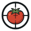

<div align="center">
  
  <h1>TomatoMAP: Tomato Multi-Angle Multi-Pose Dataset for Fine-Grained Phenotyping</h1>
</div>


<div align="center">
<b>A Novel Dataset for Tomato Fine-Grained Phenotyping</b>
</div><br>

<div align="center">
  <a href="https://0yj.github.io/tomato_map/"></a>
  <a href="https://arxiv.org/abs/2507.11279"></a>
  <a href="https://github.com/0YJ/TomatoMAP"></a>
  <a href="https://doi.ipk-gatersleben.de/DOI/89386758-8bfd-41ca-aa9c-ee363e9d94c9/073051f0-b05e-4b43-a9cd-0435fe7cd913/2/184794008"></a>
  <a href="https://0yj.github.io/tomato_map/"></a>
</div><br>

<div align="center">
<a href="https://orcid.org/0009-0004-8160-809X">Yujie Zhang</a>,
<a href="">Sabine Struckmeyer</a>,
<a href="https://orcid.org/0000-0003-4753-7801">Andreas Kolb</a>,
<a href="https://orcid.org/0000-0001-9779-9610">Sven Reichardt</a>
</div><br>

[TomatoMAP](https://0yj.github.io/tomato_map) is a novel dataset generated from our multi camera array based on **findability**, **accessibility**, **interoperability**, and **reusability** (FAIR). The data generation and annotation take two years with multiple domain experts. 
TomatoMAP includes three subsets, TomatoMAP-Cls, TomatoMAP-Det and TomatoMAP-Seg for 50 BBCH classification, 7 main area detection, and 10 classes instance segmentation for fine-grained phenotyping. The dataset has also unique 3D modeling potential for further research.

If you need any help, submit a ticket via [GitHub Issues](https://github.com/0YJ/TomatoMAP/issues). 

## 📜 License

- TomatoMAP dataset is released under [CC BY 4.0](https://creativecommons.org/licenses/by/4.0/). Commercial use requires permission.
- TomatoMAP code space is released under [Apache 2.0](https://www.apache.org/licenses/LICENSE-2.0).

## 📢 Updates

* 15.07.2025: Paper available on [arXiv](https://arxiv.org/abs/2507.11279)
* 18.07.2025 Full dataset release on [e!DAL](https://doi.ipk-gatersleben.de/DOI/89386758-8bfd-41ca-aa9c-ee363e9d94c9/073051f0-b05e-4b43-a9cd-0435fe7cd913/2/184794008)
* 18.07.2025 Submit to Nature
* 23.07.2025 Code repo public

## 🌠 Coming Soon
* Claim e!DAL DOI
* TomatoMAP builder on Colab
* User friendly Web UI demo
* Update homepage

## ✨ Getting Started
Please check [code](https://github.com/0YJ/TomatoMAP/tree/main/code) subfolder for more details. Or click: 
<details>
  <summary>Expand details</summary>

### Requirements
We suggest using [conda](https://www.anaconda.com/) for env management. 
```
git clone https://github.com/0YJ/TomatoMAP.git
cd TomatoMAP
conda env create --file environment.yml
conda activate TomatoMAP
cd code
```
We use notebook as TomatoMAP builder (script version coming soon).
```bash
jupyter notebook
```

Using fine-tuned parameters for training your own model:
```bash
cp det/best_hyperparameters.yaml ./

# unzip TomatoMAP dataset you downloaded from our e!DAL repo under code/ folder
```
Then follow the guide under TomatoMAP_builder.ipynb to finish the dataset setup. 

### Project Structure

```
TomatoMAP/
├── main.py                # Main entry
├── README.md              # Introduction
├── requirements.txt       # Dependencies
│
├── avh/                   # AI vs Human Analysis
│
├── seg/                   # Segmentation package
│
├── cls/                   # Classifier
│
├── det/                   # Detection package
│   ├── TomatoMAP-Det.yaml     # YOLo training settings
│   └── best_hyperparameters.yaml     # Fine-tuned hyperparameters
│
├── trainers/              # Training modules
│   ├── cls_trainer.py     # Classification trainer
│   ├── det_trainer.py     # Detection trainer
│   └── seg_trainer.py     # Segmentation trainer
│
├── datasets/              # Dataset handling
│   ├── cls_dataset.py     # Classification dataset
│   └── seg_dataset.py     # Segmentation dataset utilities
│
├── models/                # Model definitions
│   ├── cls_models.py      # Classification models
│   └── seg_hooks.py       # Segmentation training hooks
│
├── utils/                 # Utility functions
│   ├── common.py          # Common utilities
│   ├── visualization.py   # Visualization tools
│   └── isat2coco.py       # Format converter for Seg
│
└── outputs/              # Training outputs (created automatically)
    ├── cls/              # Classification results
    ├── det/              # Detection results
    └── seg/              # Segmentation results
```

## Usage

### Classification Training

Train a classification model on TomatoMAP-Cls dataset:

```bash
# default training with MobileNetV3-Large
python main.py cls --data-dir ./TomatoMAP/TomatoMAP-Cls --epochs 100

# options
python main.py cls \
    --data-dir ./TomatoMAP/TomatoMAP-Cls \
    --model mobilenet_v3_large \
    --epochs 100 \
    --batch-size 32 \
    --lr 1e-4 \
    --img-size 640 640 \
    --patience 5 \
    --output-dir outputs/cls/experiment1
```

Available models:
- `mobilenet_v3_large` (default)
- `mobilenet_v3_small`
- `mobilenet_v2`
- `resnet18`

### Detection Training

Train a YOLO model on TomatoMAP-Det dataset:

```bash
# default training with YOLO11-Large
python main.py det --data-config ./det/TomatoMAP-Det.yaml --epochs 500

# options
python main.py det \
    --data-config ./det/TomatoMAP-Det.yaml \
    --model yolo11l.pt \
    --epochs 500 \
    --img-size 640 \
    --batch-size 4 \
    --patience 10 \
    --device 0 \
    --output-dir outputs/det/experiment1 \
    --hyperparams ./det/best_hyperparameters.yaml
```

### Segmentation Training

Train a Mask R-CNN FPN based model on TomatoMAP-Seg dataset:

```bash
# training
python main.py seg train \
    --data-dir ./TomatoMAP/TomatoMAP-Seg \
    --model COCO-InstanceSegmentation/mask_rcnn_R_50_FPN_3x.yaml \
    --epochs 100 \
    --lr 0.0001 \
    --batch-size 4 \
    --patience 5

# evaluation
python main.py seg eval \
    --data-dir ./TomatoMAP/TomatoMAP-Seg \
    --model-path model_best.pth \
    --output-dir outputs/seg

# visualization
python main.py seg vis \
    --data-dir ./TomatoMAP/TomatoMAP-Seg \
    --model-path model_best.pth \
    --n 5 \
    --output-dir outputs/seg

# dataset information
python main.py seg info --data-dir ./TomatoMAP/TomatoMAP-Seg

# analyze object size (small, big, middle)
python main.py seg analyze --data-dir ./TomatoMAP/TomatoMAP-Seg
```

Available models:
- `COCO-InstanceSegmentation/mask_rcnn_R_50_FPN_1x.yaml`
- `COCO-InstanceSegmentation/mask_rcnn_R_50_FPN_3x.yaml`
- `COCO-InstanceSegmentation/mask_rcnn_R_101_FPN_3x.yaml`
- `COCO-InstanceSegmentation/mask_rcnn_X_101_32x8d_FPN_3x.yaml`

## Dataset Preparation

### Classification Dataset Structure
```
TomatoMAP-Cls/
├── train/
│   ├── BBCH class1/
│   │   ├── img1.jpg
│   │   └── ...
│   └── BBCH class2/
│       └── ...
├── val/
│   └── ...
└── test/
    └── ...
```

### Detection Dataset Structure
```
TomatoMAP-Det/
├── images
└── labels
```

### Segmentation Dataset Structure
```
TomatoMAP-Seg/
├── images/               # All images
│   ├── img1.JPG
│   └── ...
├── labels/               # All labels in COCO format
    ├── isat.yaml         # Label and class configuration
    └── img1.json
```
</details>

## 🤝 Acknowledgements
This project is powered by the [de.NBI Cloud](https://www.denbi.de/) within the German Network for Bioinformatics Infrastructure (de.NBI)
and ELIXIR-DE (Research Center Jülich and W-de.NBI-001, W-de.NBI-004, W-de.NBI-008, W-de.NBI-010,
W-de.NBI-013, W-de.NBI-014, W-de.NBI-016, W-de.NBI-022), [Ultralytics YOLO](https://www.ultralytics.com/), [Meta Detectron2](https://ai.meta.com/tools/detectron2/), [ISAT](https://github.com/yatengLG/ISAT_with_segment_anything), and [LabelStudio](https://labelstud.io/). Thanks to [JetBrains](https://www.jetbrains.com) for supporting us with licenses for their tools.
[](https://www.jetbrains.com)

## 🌟 Citation

If you use TomatoMAP in your research and think our project is useful, please cite:

```bibtex
@misc{zhang2025tomatomultianglemultiposedataset,
      title={Tomato Multi-Angle Multi-Pose Dataset for Fine-Grained Phenotyping}, 
      author={Yujie Zhang and Sabine Struckmeyer and Andreas Kolb and Sven Reichardt},
      year={2025},
      eprint={2507.11279},
      archivePrefix={arXiv},
      primaryClass={cs.CV},
      url={https://arxiv.org/abs/2507.11279}, 
}


@dataset{tomatomap,
  title={TomatoMAP: Tomato Multi-Angle Multi-Pose Dataset for Fine-Grained Phenotyping},
  author={Yujie Zhang and Sabine Struckmeyer and Andreas Kolb and Sven Reichardt},
  journal={e!DAL-Plant Genomics and Phenomics Research Data Repository (PGP)},
  year={2025}
}
```
