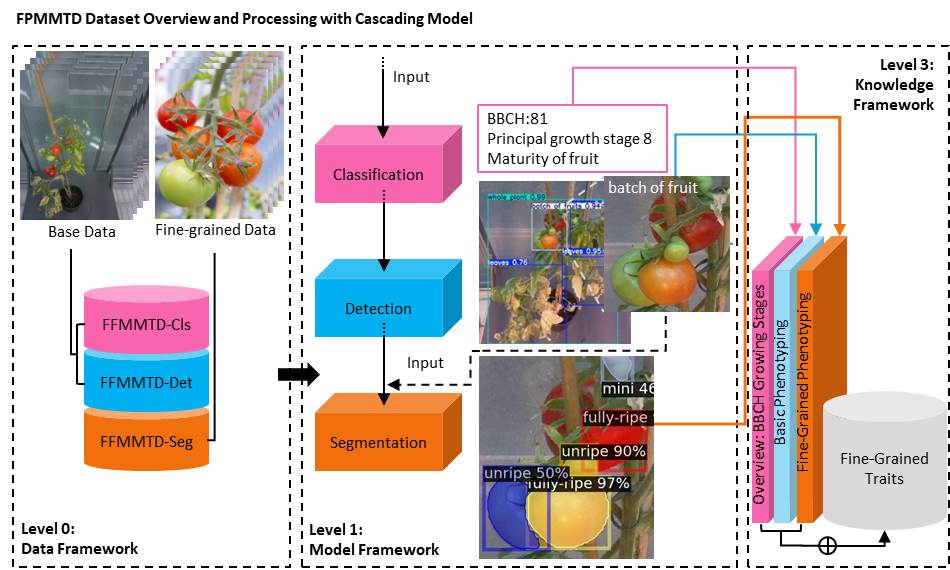

## TomatoMAP

<p align="center">
  
</p>

Offical code repository for the manuscript "Tomato Multi-Angle Multi-Pose Dataset for Fine-Grained Phenotyping"

### TomatoMAP Dataset
---------------
You may want to firstly download [TomatoMAP](https://ipk-cloud.ipk-gatersleben.de/s/cey233Fsdcs8nti) data. We suggest reading [README](https://github.com/0YJ/MPTSTD/blob/main/README.md) before using the dataset.

### TomatoMAP Cascading Processing for Cls, Det
```bash

```

Citation
--------------

Please cite the [FPMMTD paper](https://www.ph.com/placeholder.pdf) if it helps your research:
```bibtex

```
